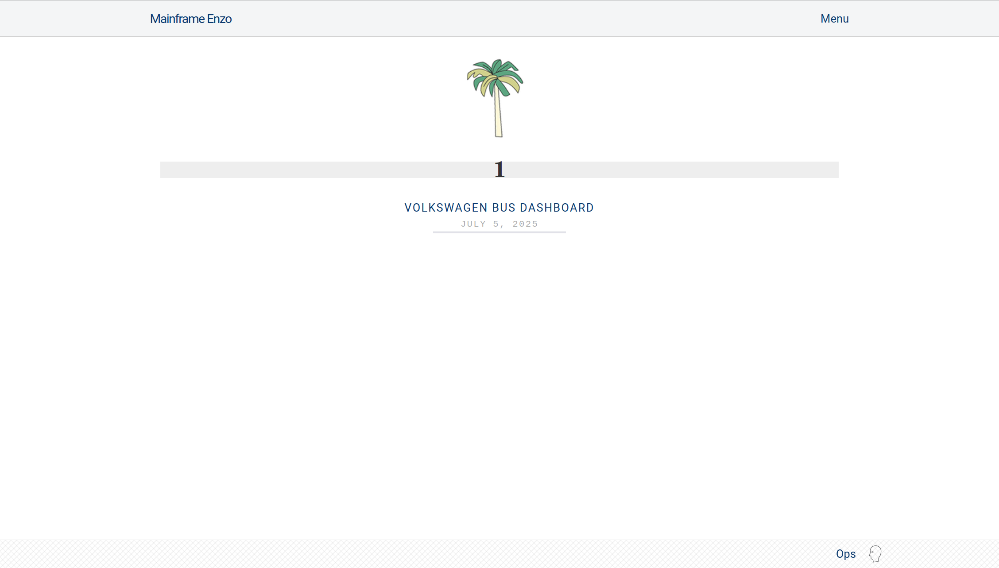
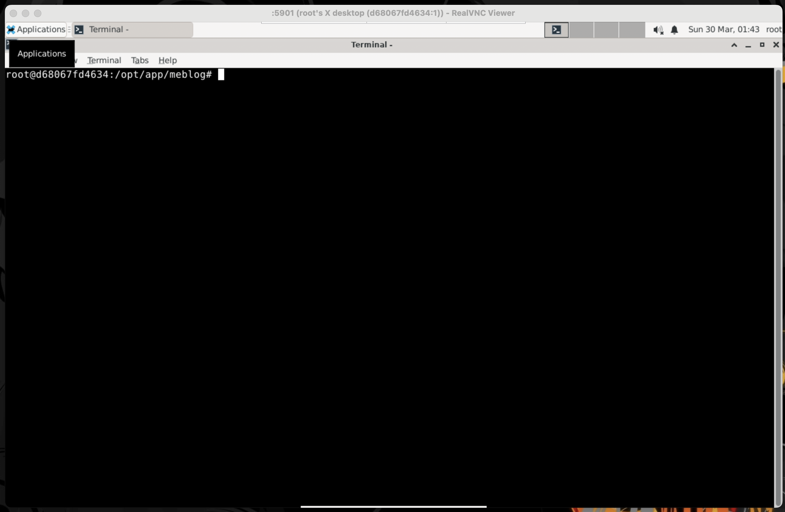
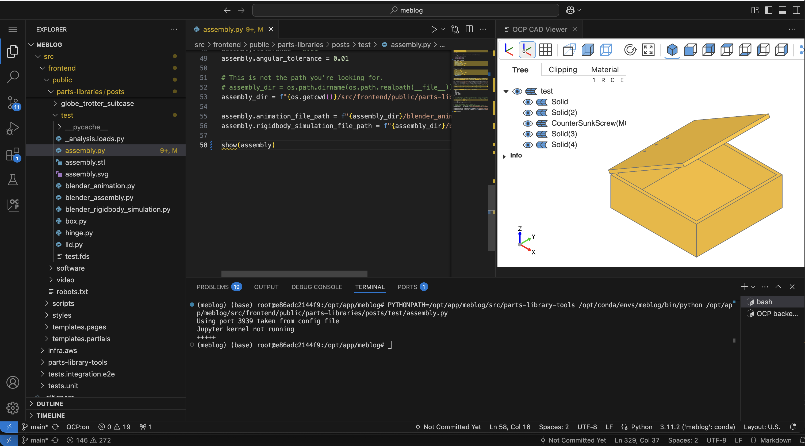

# mainframenzo.com
This is the public source for your silly blog. The documentation below addresses _future_ you.



FYI: You reset the commit history every time you push to this public repository; it's always the "First commit." (as your mentor once said, "It's [always] a new day, baby")

----

You provide three ways to get started writing posts and managing website hosting infra:
* Docker Container
* Virtual Machine
* Host OS (locally)

Docker is not a hard dependency for writing posts or managing website hosting infra, but it simplifies dependency installation and _definitely_ made developing the parts libraries easier. You also provided a Virtual Machine as an "escape hatch". Mostly you write posts on your host OS (locally), and then run a container (via Docker) if you need to do parts libraries and one-offs development in tandem. If your host OS gets hosed, you can basically do everything in Docker (and therefore, also in the Virtual Machine) if you need to.

# Table of Contents

- [AI](#ai)
- [Local Development - Docker](#local-development---docker)
  - [Pre-reqs](#local-development---docker--pre-reqs)
- [Local Development - Virtual Machine](#local-development---virtual-machine)
  - [Pre-reqs](#local-development---virtual-machine--pre-reqs)
- [Local Development (Host OS)](#local-development)
  - [Pre-reqs](#local-development--pre-reqs)
  - [Pre-reqs for Parts Libraries](#local-development--pre-reqs-for-parts-libraries)
  - [Pre-reqs for Utilities](#local-development--pre-reqs-for-utilities)
  - [Pre-reqs for One-offs](#local-development--pre-reqs-for-one-offs)
    - [Personal Case Study Number 2](#local-development--pre-reqs-for-one-offs--personal-case-study-number-2)
  - [Frontend](#local-development--frontend)
    - [Setup](#local-development--frontend--setup)
    - [Writing Posts](#local-development--frontend--writing-posts)
      - [Style Guide](#local-development--frontend--writing-posts--style-guide)
      - [Parts Libraries](#local-development--frontend--writing-posts--parts-libraries)
    - [Tests](#local-development--frontend--tests)
  - [Backend](#local-development--backend)
    - [Tests](#local-development--backend--tests)
- [Infra](#infra)
  - [Pre-reqs](#infra--pre-reqs)
  - [Configure](#infra--configure)
  - [Deploy](#infra--deploy)
    - [Docker](#infra--deploy--docker)
  - [Debug](#infra--debug)
  - [Publish](#infra--publish)
  - [Ops](#infra--ops)
  - [Destroy](#infra--destroy)
    - [Docker](#infra--destroy--docker)
  - [Pen Test](#infra--pen-test)
  - [CICD](#infra--cicd)
  - [Load Test](#infra--load-test)
  - [Security](#infra--security)
- [Utilities](#utilities)
  - [Images](#utilities--images)
  - [Videos](#utilities--videos)
  - [Playlists](#utilities--playlists)
  - [Parts Library Rendering](#utilities--parts-library-rendering)
  - [Generate Downloads](#utilities--generate-downloads)
  - [Tests](#utilities--tests)
- [VSCode Extension](#vscode-extension)
- [Firefox Extension](#firefox-extension)
- [One-offs](#one-offs)
  - [Playlist Analyzer](#one-offs--playlist-analyzer)
  - [Personal Case Study Number 2](#one-offs--personal-case-study-number-2)
  - [Zine Mode Intro](#one-offs--zine-mode-intro)
- [License](#license)

## AI
[↑ Table of Contents](#table-of-contents)

You originally started using LLMs similarly to how you used [StackOverflow](https://stackoverflow.com/questions) (or any of the Stack "Exchanges", for that matter), which was _primarily_ as a "search" tool you input text into when you'd lost your marbles debugging some esoteric thing someone drummed up one day that now the entire internet is built on. They mostly sucked, TBH. Big Search Engine was returning such shit results that even though the LLMs sucked, they sometimes sucked less than search. Another tool in the box, perhaps. Others were making heavy use of LLMs, though: they made the intern's software demos better at the last place you worked at, but what they produced was still throwaway. The LLM-generated code was often worse than if the intern had just found samples put out for Some SDK and plucked what they needed...at least until Some SDK's samples were LLM-generated. The intern still needed to learn the hard way. (And if the intern responded with one more "Claude said...", _they_ might be thrownaway).

_Occasionally_ LLMs would prove useful. You saw things change in early 2026, though: they became _more_ useful. And you saw others see this too. Still, you were hesitant.

----

You got into software as a "hobbyist" for two reasons:
1) to share
2) to alter or analzye the physical using the digital

One day "hobbyist" turned to "professional" after you landed a job at a startup. You never _really_ looked back.

----

You remembered being tired of writing development tools for software developers about a decade ago. Developers were always so unimpressed. "I could do that". You remember being that way, too, early on. You wish you could recommend the piece you read that one time which ate its way in, slowly shaping your mind and eventually your behavior in situations like that, should the roles have been reversed. Software development tools were _not_ the reason you got into this. And while reasons can change, yours had not. So you moved on. And maybe now it was time to move on, too - not from software, but from how you saw yourself in software. But you were having trouble with this.

----

You appended some slides onto a digital talk before you left your last Big Tech job about capital-Q Quality. In a "room" (digital) full of snake-oil sellers, the slides were intended for the few builders that might see it. It was about LLMs, Quality, and taste - you've heard the ideas by now. Both the reference and the talk didn't hit, but later on you would hear from a junior engineer feeling similarly. That was nice. You would later also see features of the software product you built (what the talk was about) - a product which would never see the light of day - ripped off and stuffed into a worse product, clearly aided by by an LLM (you could see the code). Vindication, you guess.

----

How you use LLMs _has_ gradually changed, mostly as a result of _employment requirements_. So yea, it was forced, but more implicitly as a result of expectations changing, i.e. "show me the dashboard, Jerry". Employment requirements amounted to: "we don't care about anything _but_ shipping this software, verified or not". Funny how Quality doesn't seem to matter, just that it _looks_ like it matters. $$. How you use LLMs has also gradually changed because jobs you took _both_ ended up in the same place: evaluating systems that use LLMs and anything that empowers them. You read the research, and understand - to a lesser degree than many - how LLMs fail, and sometimes - why. So you gave them a shot. What, now you're a fucking _vibe_ coder? Oh, my sweet summer child - no.

----

LLMs _are_ proving useful for someone like you. You spent years writing code. You spent years learning multiple languages. You spent years debugging. You spent time with the best of 'em, playing catch up on CS in your off hours so you could hang. And you did. You _learned_ the hard way! And during this time, you adopted practices which helped you type less when slinging code (there's a reason you prefer "-" vs "_" - it's one less finger to move); isn't an LLM's involvement just _another_ one of those practices?

One of your main use-cases for using LLMs - write a component once, then copy+paste it around and modify - was not really that different from your previous approach before they existed - now you just got _some_ modifications for "free". Free?

----

You enjoy the act of thinking through a problem: nothing like a good, handy-dandy notebook session. You also enjoy writing code (and got quite good at it), but it's not your personality. You're not one of the hobbyist types who likes to write code _just_ to write code (no offense - there are other outlets you have for this type of Zen and the Art of `<Art>`). LLMs have taken some fun out of the job in some areas, but they've also introduced _new_ fun in others - verification. Researching and verifying, something you never got to do enough of as a result of being labeled a "builder", became the fun part. You got to actually solve the problem in whatever medium you wanted, then translate that to software. And once you started down this road, you realized that really you were just back to creating deterministic software that LLMs can use. Turtles all the way down, you guess. Unless your employer doesn't care about verification ;)

You don't really enjoy using LLMs, though. There's too much taint. No Eureka! moments. You have as much disdain for non-local LLM providers as you do for the Big Tech Directors saying that "only features which generate 10x revenue should ship". _Where_ is the humanity? If you hear one more person say "their job is to maximize shareholder value", you're going to puke...possibly in their face. How's _that_ for humanity?

----

Which brings you to the ethical dilemma: **how LLMs are trained, how they're used, what resources they consume being used** (with so much _emphasis_) means "animals were/are being hurt" for efficiency gains. While this existed before (think Congo mine conditions), is there any reason to compound it?! And of course we all are subsidizing the cost of LLMs way or another, your ethics and civilization be damned. You find LLMs interesting in a [Diamond Age](https://en.wikipedia.org/wiki/The_Diamond_Age) sort of way (let's not forget the lesson there!) - you want to be enriched, not just to defer (though you don't care about deferring for shit you've already completed a hundred times, much like deferring to a dependency). So you still write nearly all of the code on this blog (~98%, according to your [calculations](.justfiles/auditing.just)), and the writing is 100% all you. Nobody wants to read LLM-generated bullshit. You certainly don't.

You are having some success using recent LLMs for:
* Work you don't care to do (generate an OpenAPI schema for a Github Webhook)
* Work that would take exorbitant amounts of time (go find Wikipedia band links for each song in a playlist)
* Catching spelling/software/grammar mistakes made in the wee hours of the morning
* MVPs in domains you don't know much about
* Data analyses
* Pen testing
* So much data scraping (mostly for "good", e.g. city budget tooling)

You think it's important (and interesting) to document where an LLM was used, so you did that.

A list of wholly LLM-generated things in this source:
* [./src/openapi-def/github.webhook.push.schema.yaml](./src/openapi-def/github.webhook.push.schema.yaml) - You didn't care to spend time investing in the Microsoft ecosystem

A list of partially LLM-generated things in this source (you went through LLM-generated output to understand it, then heavily modified the code to meet your needs and style):
* [./src/vscode-extension](./src/vscode-extension/) - You didn't care to spend time investing in the Microsoft ecosystem
* Some of the monitoring schemas in [./src/openapi-def/](./src/openapi-def/) - You were able to rough out OpenAPI schemas from bash function responses, which saved you some tippy-tapping when pulling in piecemeal parts of [an existing monitoring solution](https://github.com/andchir/linux-dash2)
* Some of the web components for charts in [./src/frontend/scripts/](./src/frontend/scripts/) - You were able to rough out a "vanilla" web component for a chart used on the ops dashboard, then build on that for other charts, which saved you some tippy-tapping
* Once you had monitoring data and web components, you were able to rough in an ops dashboard and wire up a few charts manually, then have an LLM follow your lead to generate data formatting functions
* Some of the [DuckDB metrics scaffolding](./src/backend/metrics.db.ts) - It took longer than expected to migrate from AWS, and the last thing you needed before pushing a website update was metrics, so you _quickly_ built out a bring-your-own-metrics solution that needed a place to put ze data (the LLM saved you some time having to RTFM, but you still had to RTFM TBH...and also the metrics solution is buggy regardless)
* ~~Some of the CSS in [./src/frontend/styles/framework.css](./src/frontend/styles/framework.css) - You were able to migrate off of Milligram - an ancient CSS framework you built this blog on fifteen years ago but grew out of~~ The LLM did pretty poorly with this one, but it was used to some degree, with the slack being taken up by ramming my head against a wall
* Some of the Vite build logic in [./.justfiles/frontend.just](./.justfiles/frontend.just) - Vite has matured substantially and _mostly_ works better than [your small build tools](./.justfiles/frontend.legacy.just), but you kept the latter around JIC the tool goes to shit or becomes pay-to-play
* With _caressing_, most of the statics analysis and "tests" in [./src/frontend/one-offs/posts/personal_case_study_number_2/cantilever-gate-truss-analyzer/](./src/frontend/one-offs/posts/personal_case_study_number_2/cantilever-gate-truss-analyzer/)
* You had an existing [playlist-fixup script](./build-utils/scripts/fixup-playlist-urls.ts) which searches YouTube and updates playlist CSV files with YouTube URLs, and you used an LLM to rough in the same functionality for Wikipedia and Deezer
* You initially roughed in a lot of analysis tools for the one-off playlist analyzer at [./src/frontend/one-offs/playlist-analyzer](./src/frontend/one-offs/playlist-analyzer/) - The goal was _analysis_, but you found a middle-ground
* You initially roughed in [image srcset generation](./build-utils/scripts/image-srcsets.ts) - Your website had image load latency issues after leaving AWS (it always had image load issues, but probably the CDN placements of AWS helped), and you were tired of migrating features (custom analytics, etc.) and it taking away from writing time
* [./justfiles/auditing.just](./justfiles/auditing.just) - You roughed in some bash functions for LOC calculation

^ The LOC table (it's a WIP):
```txt
EXT             TOTAL        HUMAN          LLM   HUMAN%     LLM%
------------------------------------------------------------------
ts              61451        60328         1123    98.2%     1.8%
json           328835       328712          123   100.0%     0.0%
js                 47           47            0   100.0%     0.0%
yaml             6585         5489         1096    83.4%    16.6%
py              23774        22240         1534    93.5%     6.5%
sh               1755         1755            0   100.0%     0.0%
xml               346          346            0   100.0%     0.0%
tf                690          690            0   100.0%     0.0%
css              8630         8328          302    96.5%     3.5%
md              37340        36842          498    98.7%     1.3%
ejs              2007         2007            0   100.0%     0.0%
html             1071          412          659    38.5%    61.5%
csv             23219        23219            0   100.0%     0.0%
------------------------------------------------------------------
TOTAL          495750       490415         5335    98.9%     1.1%
```

----

All that to say:

The job has changed, at least at the places you find work. You don't think you'd want to get into software professionally if you were starting now. Being a professional meatbag harness doesn't sound fun in any industry. And working in software seems to either mean working for companies doing evil shit, or doing contract work for companies contractually obligated to companies and/or governments doing evil shit, or doing something _so_ boring as to make you want to take a long walk off a short pier. I don't want to sell anything, buy anything, or process anything...

You'd say that the world has changed too, but you think usually what changed is referring to _people_, and you don't think people have or could, in spite of their needing to.

What's next? - J.B.

## Local Development - Docker
[↑ Table of Contents](#table-of-contents)

If you already have your designs finalized and rendered, you can move along and just install some standard dependencies on your host OS to write your posts. Parts libraries and one-offs have the most dependencies, and it's easiest to use Docker to build their artifacts.

### Local Development - Docker / Pre-reqs
[↑ Table of Contents](#table-of-contents)

1. [Docker](https://www.docker.com/) `27.3.1, build ce12230` (used to launch a container for local development)
1. [just](https://just.systems/man/en/introduction.html) `1.46.0` (used as a task runner - had to install with snap when using Ubuntu)
1. [Real VNC](https://www.realvnc.com/en/connect/download/viewer/) (or any VNC viewer - used for viewing container guest OS display from host OS)

----

As an initial pre-requisite for using Docker, build the container image and push to your own local registry (more on why your own local registry is used can be found in the [Infra / Deploy](#infra--deploy) section later on in this readme). From a terminal, run:
```bash
just -f ./.justfiles/docker.just --working-directory . start-local-registry
just -f ./.justfiles/docker.just --working-directory . setup
just -f ./.justfiles/docker.just --working-directory . push-latest-development-image-to-local-registry
```

To use Docker to start viewing content and making changes to the website locally, from a terminal, run:
```bash
just -f ./.justfiles/docker.just --working-directory . develop-website
```

Other flags are available to you:
* `--skip-build-parts-libraries` Skips generating .stl files and rendering images of parts libraries
* `--skip-build-one-offs` Skips building one-off projects

The `<meblog-src>/src` directory is mounted as a read/write volume, and changes you make on your host OS will propagate to the guest OS. FIXME You haven't quite gotten nginx to proxy to vite's static assets properly, so for now you'll need to open up a browser tab at [http://localhost:8080](http://localhost:8080) to view the website (not nginx's [https://localhost:443](https://localhost:443)). You can also open a browser tab up at [http://localhost:8082](http://localhost:8082) to use Visual Studio Code + OCP CAD Viewer in the container to preview changes you make to the parts libraries.

If you want to connect to the guest OS's desktop GUI, you used RealVNC and entered in `:5901` as the "hostname or address", and `meblog` as the password:


Once inside the container, you can run these software programs to develop parts libraries:
* CQ-editor - From a terminal, run: `cd / && ./CQ-editor/CQ-editor`

## Local Development - Virtual Machine
[↑ Table of Contents](#table-of-contents)

There are two reasons you use local virtual machines:
* Some of the software you were using had not quite caught up to the new Apple hardware (you went back and forth between Linux and MacOS laptops), and you were even having issues with Docker containers when it came to some headless rendering dependencies. You are no longer using MacOS for development of this source, but if you experience issues with installing dependencies, either on your host OS or via Docker, you can take it one step further and do local development on a virtual machine to "ease your pain".
* It makes debugging hosted infra deployments easier and cheaper. If you are having issues deploying to Hetzner and debugging cloud-init, you can deploy the infra locally visa vie a virtual machine to "ease your pain".

### Local Development - Virtual Machine / Pre-reqs
[↑ Table of Contents](#table-of-contents)

1. [multipass](https://canonical.com/multipass) `2.4.3` ^  (used for local VM deployment with Terraform)
1. [Terraform](https://developer.hashicorp.com/terraform) `v1.14.5` (used to define/deploy website infra as code)
1. [just](https://just.systems/man/en/introduction.html) `1.46.0` (used as a task runner - had to install with snap when using Ubuntu)
1. [rsync](https://linux.die.net/man/1/rsync) `version 2.6.9 protocol version 29` (used for copying files)

----

To launch the local virtual machine infra, from a terminal, run:
```bash
just -f ./.justfiles/infra.local.just --working-directory . setup
just -f ./.justfiles/infra.local.just --working-directory . deploy-local
```

To print the cloud-init logs for a local virtual machine infra's _publish stage_ e.g. _dev_, from a terminal, run:
```bash
just -f ./.justfiles/infra.local.just --working-directory . cat-cloud-init-output-log dev
```

You can open up the LAN IP the local virtual machine was assigned in the browser, e.g. `http://10.176.219.145/`.

To ssh into the local virtual machine for a _publish stage_ e.g. _dev_, from a terminal, run:
```bash
just -f ./.justfiles/infra.local.just --working-directory . ssh-into dev
```

To destroy the local virtual machine infra, from a terminal, run:
```bash
just -f ./.justfiles/infra.local.just --working-directory . destroy-local
```

## Local Development
[↑ Table of Contents](#table-of-contents)

You can develop the website locally (on your host OS) if you've already pre-rendered the parts libraries.

### Local Development / Pre-reqs
[↑ Table of Contents](#table-of-contents)

If a pre-req isn't listed further below (say, a one-off), it's because it was already listed above.

1. 'Nix machine (you are using Framework 13 / Ubuntu, YMMV elsewhere)
1. [Firefox](https://firefox.com) (used for most everything that needs a browser)
1. [Chromium](https://www.chromium.org/getting-involved/download-chromium/) (used for generating downloads, playwright no longer supports .pdf generation with firefox)
1. [Node.js](https://nodejs.org/en/download) `20.16.0` (used for build and website dependency ecosystem)
1. [Python](https://www.python.org/) `3.13.1` (used for defining and rendering parts libraries)
1. [pixi](https://pixi.prefix.dev) (use for installing Python dependencies for working with parts libraries) `0.69.0` (heh heh)
1. [just](https://just.systems/man/en/introduction.html) `1.46.0` (used as a task runner - had to install with snap when using Ubuntu)
1. [jq](https://jqlang.github.io/jq/) `1.6` (used for working with JSON in the CLI)
1. [duckdb](https://duckdb.org/) `1.5x` (used as a metrics database)
1. [tree](https://linux.die.net/man/1/tree) `v2.1.3 (snap) © 1996 - 2024 by Steve Baker, Thomas Moore, Francesc Rocher, Florian Sesser, Kyosuke Tokoro` (used to print scrubbed source code when pushing to public version of this source)
1. [rsync](https://linux.die.net/man/1/rsync) `version 2.6.9 protocol version 29` (used for copying files)
1. [lychee](https://github.com/lycheeverse/lychee) (used to check broken links)

### Local Development / Pre-reqs for Parts Libraries
[↑ Table of Contents](#table-of-contents)

If you want to work on the parts libraries locally too, the dependencies grow.

1. [Blender](https://www.blender.org/download/) `4.2` (used for rendering parts libraries)
1. [FreeCAD](https://wiki.freecad.org/Main_Page) `1.0.0` (used for analyzing parts libraries)
1. [CalculiX](http://www.dhondt.de/) `costerwi/homebrew-calculix/calculix-ccx` (used for analyzing parts libraries)
1. [PySide](https://wiki.qt.io/PySide2) and [qt](https://doc.qt.io/) - (dependencies of FreeCAD - while you installed both via [Homebrew](https://brew.sh/) (see the [FreeCAD wiki on PySide/QT](https://wiki.freecad.org/PySide)), and ran `pip3 install pyside6`, nothing worked)
1. [imagemagick](https://imagemagick.org/index.php) `7.1.1-43` (used for generating .gif files of an assembly's movements)

----

Docker should not be a hard dependency, but if you want to develop parts libraries and visualize the changes to them quickly, it will help you bypass any issues encountered on MacOS. Why? None of the 3D viewers you tried - [OCP CAD Viewer](https://github.com/bernhard-42/vscode-ocp-cad-viewer), [CQ Editor](https://github.com/jdegenstein/jmwright-CQ-Editor), [blendquery](https://github.com/uki-dev/blendquery) - seemed to work particularly well (or at all!). It could be that MacOS and `conda` were very well the problem, not the software itself. You settled on OCP CAD Viewer, but using it is not "automatic" - see the [Utilities / Parts Library Rendering](#utilities--parts-library-rendering) section later on in this readme for details on how to get that going inside a container.

> Any other pre-reqs or third-party libraries needed will be downloaded at setup time automatically.

### Local Development / Pre-reqs for Utilities
[↑ Table of Contents](#table-of-contents)

These are utilities you run to help write posts.

1. [jpegtran](https://linux.die.net/man/1/jpegtran) `libjpeg-turbo version 2.1.5` (used for removing exif metadata)
1. [imagemagick](https://imagemagick.org/index.php) `7.1.1-43` (used for checking exif metadata removed)
1. [ffmpeg](https://www.ffmpeg.org/) `7.1` (used for compressing videos)
1. [f3d](https://github.com/f3d-app/f3d) (used for previewing .stl files generated from parts libraries)
1. [Audacity](https://www.audacityteam.org/) (used for recording/editing audio)
1. [yt-dlp](https://github.com/yt-dlp/yt-dlp/releases/latest/download/yt-dlp_linux) (used for downloading playlist media from YouTube - put this in [./build-utils/bin/yt-dlp_linux](./build-utils/bin/yt-dlp_linux) and make it executable)

### Local Development / Pre-reqs for One-offs
[↑ Table of Contents](#table-of-contents)

#### Local Development / Pre-reqs for One-offs / Personal Case Study Number 2
[↑ Table of Contents](#table-of-contents)

This post has a Rust-based application which has a digital twin of the things you made for it. It compiles to WASM and is embedded in the post's page.

1. [VMWare Workstation](https://www.vmware.com/products/desktop-hypervisor/workstation-and-fusion) (TLDR: used to model the digital twin geometry in SketchUp 2016, but optional since .vmdk file not included in this source - you exported to a .glb file that is!)
1. [BlenderKit](https://www.blenderkit.com/) (needed an account - used for adding nice materials to 3D models in Blender)
1. [BlenderGIS](https://github.com/domlysz/BlenderGIS) (needed an account - used for generating terrain in Blender which you then cross-referenced photogrammetry data)
1. [rustup](https://rustup.rs/) `1.28.1 (f9edccde0 2025-03-05)` (used to update the Rust compiler and dependency manager)
1. [rustc](https://doc.rust-lang.org/rustc/index.html) `1.85.1 (4eb161250 2025-03-15)` (used to compile the Rust application)
1. [cargo](https://doc.rust-lang.org/cargo/) `cargo 1.85.1 (d73d2caf9 2024-12-31)` (used to manage the Rust application's dependencies)

### Local Development / Frontend
[↑ Table of Contents](#table-of-contents)

#### Local Development / Frontend / Setup
[↑ Table of Contents](#table-of-contents)

Once you have the pre-reqs installed, install all the dependencies needed to build the website (basically everything, FYI). **This has global side effects.** From a terminal, run:
```bash
just -f ./.justfiles/dev.just --working-directory . setup
```

Other flags are available to you:
* `--skip-nodejs-deps` Skips installing Node.js deps
* `--skip-global-nodejs-installs` Skips installing global Node.js deps
* `--skip-python-deps` Skips installing Python deps
* `--skip-download-llm` Skips download the LLM used for monitoring

#### Local Development / Frontend / Writing Posts
[↑ Table of Contents](#table-of-contents)

To start viewing content and making changes to the website locally, from a terminal, run:
```bash
# If you want to run the backend, too:
# just -f ./.justfiles/backend.just --working-directory . run development local dev local

just -f ./.justfiles/frontend.just --working-directory . develop-website --skip-build-parts-libraries --skip-build-one-offs
```

This opens up a browser tab at [http://localhost:8080](http://localhost:8080). Making a change to most files rebuilds and reloads the website.

Posts are a mixture of Markdown and HTML. The Markdown syntax for the converter - Showdown - can be found [here](https://github.com/showdownjs/showdown/wiki/Showdown%27s-Markdown-syntax). Create posts in the `<meblog-src>/src/frontend/posts/` directory as a `.md` file. The name of the file is the name of the post, sans the file extension (spaces in filenames...oh the humanity!).

Each post needs to specify some information as "JSON-in-an-HTML-comment" at the top of the file (a nod to [Jekyll](https://jekyllrb.com/)) in order to be picked up as content for the website:
```html
<!--
{
  "draft": true,
  "type": "#thingsivemade",
  "publishedOn": "January 1, 1970",
  "tagline": "\"When in the course of computer events...\""
}
-->
```

Have a look at some existing posts for examples of what else you can do with that JSON.

Tidbits you may forget:
* Only posts marked as **"draft": false** will be _published_ to the _prod_ stage

##### Local Development / Frontend / Writing Posts / Style Guide
[↑ Table of Contents](#table-of-contents)

1. Numbers are written, e.g. fifteen not 15, except: 1) years, e.g. 2025 not two thousand and five 2) monetary values, e.g. $5.15 USD, not five dollars and fifteen cents in USD 3) In my 20's/30's/40's not twenties/thirties/forties 4) resume job durations, e.g. 2, not two 5) Coordinates, e.g. (0, 0) not (zero, zero) 6) 15 miles-per-hour or miles-per-gallon not fifteen 7) 10% not ten percent
1. Videos need be formatted as .mp4 files.
1. Images can be any format supported by the web.
1. Slideshow HTML templates are built using images prefixed with img_ in the respective post's image directory. To add images to slideshows, make sure that they follow the format: img_1.png, img_2.png, etc.
1. For BOMs (CSV files), remember that inches as `"` are escaped like `""`.

You _could_ implement some sort of spellcheck linter thingy, but uh, where's the fucking fun in that?

##### Local Development / Frontend / Writing Posts / Parts Libraries
[↑ Table of Contents](#table-of-contents)

Each post has a "parts library", which is a collection of 3D file formats and CAD-as-code Python scripts that help define the #thingsivemade. It's an ongoing modernization process, and you're doing some work outside this source to make it all more cohesive. FYI.

To _build_ all the parts libraries before developing the website, just drop the `--skip-build-parts-libraries` flag. From a terminal, run:
```bash
just -f ./.justfiles/frontend.just --working-directory . develop-website --skip-build-one-offs
```

Building parts libraries consists of things like rendering images of parts, converting parts to other 3D file formats the website makes use of, etc.

You couldn't get a parts library build to work 100% on your host OS when you used MacOS, so you use Docker to manually build a post's parts library when you're doing design work. To manually build a post's parts library, first start a terminal session in a container:
```bash
just -f ./.justfiles/docker.just --working-directory . shell
```

Then build the part library for the post inside the container:
```bash
cd /opt/app/meblog

just -f ./.justfiles/parts-libraries.just build ./src/frontend/public/parts-libraries/posts/volkswagen_bus_dashboard/v2/assembly.py
```

#### Local Development / Frontend / Tests
[↑ Table of Contents](#table-of-contents)

If you wish to run all the "end-to-end" integration tests for the frontend, from a terminal, run:
```bash
just -f ./.justfiles/frontend.just --working-directory . tests-integration-e2e development local dev local
```

Other flags are available to you:
* `--headed` Shows the browser while running tests
* `--ui` Shows the browser and opens up Playwright's test GUI (which is hella awesome)

### Local Development / Backend
[↑ Table of Contents](#table-of-contents)

There is a minimal Node.js backend in place that is used for providing various API features to the frontend. You will already have installed its dependencies. If you wish to run the backend locally, from a terminal, run:
```bash
sudo sysctl fs.inotify.max_user_watches=524288
sudo sysctl fs.inotify.max_user_instances=1024

just -f ./.justfiles/backend.just --working-directory . build
just -f ./.justfiles/backend.just --working-directory . run development local dev local
```

> Some monitoring and metrics capabilities are only available in a container due to the fact that local development on your host OS does not use nginx.

#### Local Development / Backend / Tests
[↑ Table of Contents](#table-of-contents)

If you wish to run a unit test for the backend, from a terminal, run:
```bash
just -f ./.justfiles/backend.just --working-directory . tests-unit "test.backend.metrics.ts"
```

----

If you wish to run all curl-based functional tests for the backend, start the backend, then, from another terminal, run:
```bash
just -f ./.justfiles/backend.just --working-directory . tests-functional-curl
```

If you wish to run a single curl-based functional test for the backend, start the backend, then, from another terminal, run:
```bash
just -f ./.justfiles/backend.just --working-directory . tests-functional-curl "auth.md"
```

## Infra
[↑ Table of Contents](#table-of-contents)

Porkbun is your DNS registar now (more like regi _star_, amiright?!). You migrated away from GoDaddy because it sucked. Hetzner is your hosting provider now. You migrated away from AWS because it was too expensive, but [kept the deployment code around](./makefile.infra) in case Hetzner becomes too expensive or unavailable due to geopolitical issues (the AWS migration took f'ing forever BTW - so many gaps to fill). You're viewing this source on Github, which is where the public version of this source is shared...for now. The legacy infra documentation for using GoDaddy as your DNS registrar and hosting on AWS can be found [here](./readme/infra.legacy.md).

You've got a _dev_ publish stage and a _prod_ publish stage: `dev.mainframenzo.com` includes all content, including `draft` posts, but [mainframenzo.com](https://mainframenzo.com) only has completed ones. You use _dev_ to mostly validate infra and deployment mechanisms, and _dev_ is not connected to _prod_ in any way. You restrict access to _dev_ via your public IP. You take _dev_ down when you're not using it to save costs.

The infra setup is not fancy: there's just one Hetzner account for the _publish_ stages _dev_ and _prod_ because this is a silly blog. We'll call your Hetzner account "main", which is an _app_ stage, and when you deploy, you'll run commands that change resources for the respective _publish_ stage in the "main" _app_ stage (Hetzner account); _publish_ stages - _dev_ or _prod_ - are only delineated by Terraform (groups of Hetzner resources) in the same Hetzner account. There are no bastions or any [architectural fanciness](https://github.com/francesco-oghabi/scalable-web-application-terraform-hetzner) because this is a silly blog, so Hetzner resources amount to 1 VM (Hetzner servers), an SSH key, and a firewall for each _publish_ stage. You do not have enough "media" to justify cloud storage, so rsync is run as part of the post-deploy process, and files are synced from localhost. Infra is never updated _from_ the Hetzner infra itself - you always use localhost to do this. KISS.

As for CICD, you set it up so that after an initial deployment of the VMs themselves, all that is required to push content to the either publish stage is to push Git changes to a specific branch in the private Github repository (pushing to `main` is for _dev_, pushing to `prod` is for _prod_). There's some software running on the VMs that allows Github to notify them to sync the latest source code and deploy. Set it and forget it. - RP.

You _can_ and _do_ create releases locally without CICD, too!

### Infra / Pre-reqs
[↑ Table of Contents](#table-of-contents)

1. [Docker](https://www.docker.com/) `27.3.1, build ce12230` (used to build a container for local development, also used in CICD)
1. [Terraform](https://developer.hashicorp.com/terraform) `v1.14.5` (used to define/deploy website infra as code)
1. [just](https://just.systems/man/en/introduction.html) `1.46.0` (used as a task runner - had to install with snap when using Ubuntu)
1. [jq](https://jqlang.github.io/jq/) `1.6` (used for working with JSON in the CLI)
1. [rsync](https://linux.die.net/man/1/rsync) `version 2.6.9 protocol version 29` (used for copying files)

----

You also needed to:
1. Create a Porkbun API key to use for updating DNS
1. API access must be explicitly enabled per domain in Porkbun - you enabled it for mainframenzo.com .
1. Create a Hetzner "project" and a read/write API token to use for managing resources required to host the website + CICD
1. Create a Github personal access token with read/write permissions to "Contents" to create/update releases, read-only permissions for "Metadata" to pull changes from the private Github repositories, and also give it read/write permissions to "Webhooks" to script creating the Github webhooks below
1. Create Github webhooks for the private and public versions of this source to hit Hetzner VMs and start CICD (see "Infra / Configure" for a script which does this)
1. You needed to "seed" a Github release by building the website and pushing a release manually (`v0.0.1`) to the private Github repository. When the VMs first boot, they serve the latest release in order to boot quickly, then try and build the latest source (if you don't have a website to build yet, just stub one out).

### Infra / Configure
[↑ Table of Contents](#table-of-contents)

To configure the "main" Hetzner account, configure the `<meblog-src>/config/.env` file with your Hetzner information for the "main" Hetzner account. Edit (some of) this information:

    main_meblog_release_version=0.0.1
    main_hetzner_api_token=
    main_github_username=
    main_github_token=
    main_github_dev_webhook_id=
    main_github_prod_webhook_id=
    main_github_webhook_secret=
    main_porkbun_api_key=
    main_porkbun_api_secret=
    main_backend_dev_api_url=https://dev.mainframenzo.com/api
    main_backend_prod_api_url=https://mainframenzo.com/api
    main_your_username=
    main_your_password=
    main_jwt_secret=
    main_registry_directory=
    main_media_directory=

While you are in the `<meblog-src>/config/.env` file, also edit this information:

    meblog_private_repo_name=
    meblog_public_repo_name=

You can create the Github webhooks now that the `<meblog-src>/config/.env` is configured with your Github personal access token; from a terminal, run:
```bash
just -f ./.justfiles/infra.just --working-directory . create-update-github-webhooks-main
```

> This has side effects and updates the `<meblog-src>/config/.env` file.

### Infra / Deploy
[↑ Table of Contents](#table-of-contents)

Deploying creates all resources necessary to host:
* _dev_ and _prod_ websites for this blog on separate VMs
* CICD on each publish stage's VM, which connects Github changes to CICD

To deploy resources to your "main" Hetzner account, from a terminal, run:
```bash
just -f ./.justfiles/infra.just --working-directory . deploy-main dev
just -f ./.justfiles/infra.just --working-directory . deploy-main prod
```

Other flags are available to you:
* `--force-replace` Forces VM for a publish stage to be replaced since not all Terraform changes will replace the VM
* `--use-prebuilt-development-container-image` Uploads development container image to VM so you don't have to build it on the VM to get CICD to work
* `--certbot-staging` Uses letsencrypt staging env - good for testing VM deploys since letsencrypt has limits you ran into

Both firewall rules - and in the _dev_ publish stage, the nginx allowlist - are restricted to your public IP, which may change. If you find that you can't access something....

...in the _dev_ publish stage, your best bet is to destroy and deploy the infra; from a terminal, run:
```bash
just -f ./.justfiles/infra.just --working-directory . destroy-main dev
just -f ./.justfiles/infra.just --working-directory . deploy-main dev
```

...in the _prod_ publish stage, you can just update the firewall rules; from a terminal, run:
```bash
just -f ./.justfiles/infra.just --working-directory . update-firewall-rules-for-current-ip prod
```

----

Before deploying, you can drastically speed up time to "VM CICD ready" by ensuring the development container image is built and pushed to a locally running container registry. From a terminal, run:
```bash
just -f ./.justfiles/docker.just --working-directory . start-local-registry
just -f ./.justfiles/docker.just --working-directory . push-latest-development-image-to-local-registry
```

----

If you just need to deploy to a specific publish stage in "main", e.g. `dev`, from a terminal, run:
```bash
just -f ./.justfiles/infra.just --working-directory . deploy-publish-stage main dev
```

#### Infra / Deploy / Docker
[↑ Table of Contents](#table-of-contents)

You can run all of the deploy steps in Docker (the commands are nearly the same), just swap out the justfile. For example, to deploy resources to your "main" Hetzner account with minimal dependencies installed (_in a container_), from a terminal, run:
```bash
just -f ./.justfiles/docker.just --working-directory . deploy-main
```

FIXME Get `--use-prebuilt-development-container-image` working in Docker (pass-through port 5000 and volume).

### Infra / Debug
[↑ Table of Contents](#table-of-contents)

To print the cloud-init logs for a _publish stage_ e.g. _dev_, from a terminal, run:
```bash
just -f ./.justfiles/infra.just --working-directory . cat-cloud-init-output-log dev
```

To ssh into the VM for a _publish stage_ e.g. _dev_, from a terminal, run:
```bash
just -f ./.justfiles/infra.just --working-directory . ssh-into dev
```

To list all banned IPs, from a terminal, run:
```bash
just -f ./.justfiles/infra.just --working-directory . list-banned-ips dev
```

### Infra / Publish
[↑ Table of Contents](#table-of-contents)

There are 2 source code repositories for your silly blog: one private, the other public. The private source code is _your_ "source of truth" and you _only_ work with it. The public source code is just a public artifact for viewing (you're probably reading it!) because, even with LLMs trolling the world, it's still nice to see real people's source code on the interwebz. And share. "Hack the planet" etc. etc.

When the VMs boot, they download a release from the private version of this source code. Git/Github "releases" are shared amongst _dev_ and _prod_ publish stages and help the infra come up quickly (content to run/render immediately). You only build releases for _prod_, though, so don't expect the frontend to hit the backend successfully in _dev_ w/o some further doing. The VMs initially pull the release version they run/render immediately from your locally specified [./config/.env](./config/.env) value on deploy. The standard `version` field in the [./.npm/npm.ts](./.npm/npm.ts) file is always the _next_ version you intend to _build_ and release when in _prod_.

Releases just include "frontend" code for now. This means that all the surrounding infra is always "latest", which is fine for you, and probably desirable most of the time.

To build a release locally for _prod_ without any CICD bullshit, from a terminal, run:
```bash
just -f ./.justfiles/frontend.just --working-directory . build-website-release
```

> If you haven't added any new parts, add `--skip-build-parts-libraries --skip-render-images-of-parts` to expedite this process!

To preview a generated _prod_ release locally, from a terminal, run:
```bash
just -f ./.justfiles/frontend.just --working-directory . preview-website-release
```

Here's the different ways you get new content out:
* `git push origin main` from the private version of this source code kicks off a Github webhook which makes an HTTP request to the _dev_ VM, which starts CICD if the VM is running (it may not be), but does not create a release in the private version of this source code (no need to)
* `git push origin +main:prod` from the private version of this source code kicks off a Github webhook which makes an HTTP request to the _prod_ VM, which starts CICD if the VM is running (it should be), and that may create/update a release for the private version of this source code (if successful)
* Manually run `just -f ./.justfiles/infra.just --working-directory . github-release` from the private version of this source code to create/update a Github release in the private version of this source code (this requires you to build a release of the website locally for _prod_ first)
* Manually run `just -f ./.justfiles/infra.just --working-directory . push-to-public-repo` from the private version of this source code if you want to publish public content to Github (no infra affected, requires multiple commits, all history is cleared in public repository for security reasons)

### Infra / Ops
[↑ Table of Contents](#table-of-contents)

When you left AWS, you lost a lot of monitoring features! You built a minimal monitoring system comprised of metrics, analytics, and alarms to monitor the health and security of your VMs. All of these metrics are visible on your ops dashboard, which is accessible via login.

You setup the ops dashboard to be pre-rendered using server-side rendering (SSR), and the pre-rendered content is fetched via API when you visit the ops dashboard page or change date filters. Using SSR makes it so that only authed users (you) can see the data...not that it actually matters for this silly blog.

Metrics are stored on the infra themselves because you are cheap. If a VM goes down because it was overloaded by bots, well then it is down...and so are your metrics insights. Metrics are not uploaded anywhere, and when you replace a VM, monitoring starts from scratch. In 10 years you will not care if 50 "people" visited your blog, you will just care that you got a fucking post written. But metrics _are_ handy at _present_.

You also instructed an LLM-based agent backed by a local-first model (with access to the data via an on-infra MCP server) to monitor the metrics, and issues it identifies are surfaced on the ops dashboard. You didn't give it permissions to create alarms because the technology is probabilistic.

The ops dashboard is _loosely_ based on [https://github.com/andchir/linux-dash2](https://github.com/andchir/linux-dash2), which is where you took the bash monitoring script for infra from. You find the ops dashboard nice to have for infra stats because you don't need to be at a computer terminal to login to your hosting provider's website using 2FA (you don't keep passwords with you) - all the goodies are in one place.

When you _are_ at a computer terminal, you can SSH into a VM...here's what's useful:
* `/opt/app/cloud-init.log` has less useful cloud config lifecycle logs
* `/opt/app/cloud-init-output.log` has useful cloud config logs
* `/opt/app/meblog-vm-setup.log` has more useful cloud config / VM boot logs
* `/var/log/nginx/access.logs` has nginx access logs
* `/var/log/nginx/error.logs` has nginx access logs
* `/opt/app/fail2ban.log` has fail2ban logs
* `/var/log/meblog-backend.log` has your API logs
* `/var/log/meblog-ollama.log` has your ollama logs

### Infra / Destroy
[↑ Table of Contents](#table-of-contents)

It is useful to blow all the Hetzner infra up from time-to-time. To remove all the Hetzner infrastructure for the _main_ stage (start over!), from a terminal, run:
```bash
just -f ./.justfiles/infra.just --working-directory . destroy-main
```

If you just need to destroy a specific publish stage in "main", e.g. `dev`, from a terminal, run:
```bash
just -f ./.justfiles/infra.just --working-directory . destroy-publish-stage main dev
```

#### Infra / Destroy / Docker
[↑ Table of Contents](#table-of-contents)

You can run all of the destroy steps in Docker (the commands are nearly the same), just swap out the justfile. For example, to remove all the Hetzner infrastructure for the _main_ stage (start over!) with minimal dependencies installed (_in a container_), from a terminal, run:
```bash
just -f ./.justfiles/docker.just --working-directory . destroy-main
```

### Infra / CICD
[↑ Table of Contents](#table-of-contents)

The CICD process only works in a container. You are going to want to build the website via CICD to validate build process changes before deploying to a publish stage. To vet CICD and build the website for the _local_ app stage/_dev_ publish stage/_local_ app location, from a terminal, run:
```bash
just -f ./.justfiles/docker.just --working-directory . start-cicd local dev local
```

Other flags are available to you:
* `--skip-build-parts-libraries` Skips generating .stl files and rendering images of parts libraries
* `--skip-render-images-of-parts` Generates .stl files et. al. but skips rendering images of parts libraries
* `--skip-build-one-offs` Skips building one-off projects
* `--fast-render` Dials down parts libraries rendering settings

### Infra / Pen Test
[↑ Table of Contents](#table-of-contents)

You implemented a series of OWASP ASVS-based penetration tests to be run during CICD. You followed the [cheat sheet](https://cheatsheetseries.owasp.org/index.html). The cheat sheet's .md files are included alongside the pen test source for easy back-and-forth.

To run the OWASP ASVS-based penetration tests, first ensure that a development Docker container is running. Then, from a terminal, run:
```bash
just -f ./.justfiles/docker.just --working-directory . pen-test local dev local "owasp-asvs"
```

You also instructed an LLM-based agent backed by a local-first model (with access to a browser via an on-infra MCP server) to "make up" penetration tests. To run the LLM-based penetration tests, from a terminal, run:
```bash
just -f ./.justfiles/docker.just --working-directory . pen-test local dev local "ai"
```

### Infra / Load Test
[↑ Table of Contents](#table-of-contents)

You needed a way to get real data of a VM falling over so you could vet performance improvements and set decent alarm thresholds. Load tests always run against the _dev_ publish stage and require a separate VM to be launched (only 1...you've got a budget).

To run a load test, first ensure that the _dev_ publish stage is up. Then, from a terminal, run:
```bash
just -f ./.justfiles/infra.just --working-directory . deploy-publish-stage main dev
```

To create the load test infra, from a terminal, run:
```bash
just -f ./.justfiles/infra.just --working-directory . start-load-test main dev
```

To get on-demand load test metrics from the orchestrator clients, from a terminal, run:
```bash
just -f ./.justfiles/infra.just --working-directory . watch-load-test main dev
```

To see how well the _dev_ publish stage's infra is holding up, simply login and go to `https://dev.mainframenzo.com/ops.html`.

To destroy the load test infra, from a terminal, run:
```bash
just -f ./.justfiles/infra.just --working-directory . stop-load-test main dev
```

### Infra / Security
[↑ Table of Contents](#table-of-contents)

You will probably need a refresher on "security" by the time you get back to this. You are trying to avoid these things:
* Personal information leaking
* Secrets for Github leaking, allowing someone to delete the private & public versions of this source
* Secrets for Porkbun leaking, allowing someone to mess with the DNS for this blog (2FA is enabled for everything else, and API access is disabled for other domains you own)
* Secrets for Hetzner leaking, allowing someone to spin up a whole bunch of infra for...are the kids still crypto mining?
* letsencrypt certificates leaking
* Bonus: preventing media files from getting downloaded

What you are doing to potentially enable those things happening:
* Committing secrets in a .env file to the private version of this source
* Storing letsencrypt certificates off-host
* Passing secrets on the command line

What you are doing to mitigate those things happening:
* Separating public and private sources
* Local backups of source (more up to date than Github, TBH)
* Scrubbing sensitive data before pushing to the public source
* Replacing VMs is quick and forces letsencrypt certificate renewal
* Deleting all history on "git push" to the public source
* Git releases are only stored privately
* Limiting VM SSH access to your public IP
* Limiting dev VM uptime
* Restricting dev VM access to your public IP
* Secrets are replaced often
* JWTs expire quickly and don't really do much except enable playlist song downloading
* Copying built source (dist.frontend) to the public nginx /var/www/html directory to separate from source code
* Sanitizing user data when received on the backend
* Preventing hidden files from being served via nginx
* Honeypot to ban bot crawlers from finding things, sensitive or not

Ok, now that you are back up to speed, here are the lifecycles of important secrets:

**Github Webhook secret** _Occasionally_ when you deploy infra for a publish stage:
* Generate a new Github Webhook secret for the publish stage
* Update the `<meblog-src>/config/.env` file with the secret
* Update the Github Webhook with the secret
* Update the VM for the publish stage with the secrets by syncing the `<meblog-src>/config/.env` file to it

You should probably rotate the webhook secret more often, but FIXME you're still migrating CICD off AWS, so the webhook secrets aren't even in use.

**JWT secret** _Every_ time you deploy infra for a publish stage:
* Generate a new JWT secret for the publish stage
* Update the `<meblog-src>/config/.env` file with the secret
* Update the VM for the publish stage with the secrets by syncing the `<meblog-src>/config/.env` file to it

The side effects of this are:
* If you, yes _you_, try to make an authenticated request - say download a playlist song - it will fail with 403, the frontend will log you out, and you'll need to login again. Speaking of which...

**Username/Password secrets** _Every_ time you deploy infra for a publish stage:
* Generate new Username/Password Secrets for the publish stage
* Update the `<meblog-src>/config/.env` file with the secrets
* Update the VM for the publish stage with the secrets by syncing the `<meblog-src>/config/.env` file to it

The side effects of this are:
* You will probably not have the correct username/password on your phone when you need to login. FIXME figure that out.

## Utilities
[↑ Table of Contents](#table-of-contents)

### Utilities / Images
[↑ Table of Contents](#table-of-contents)

Images may need to be "fixed up" before being website ready: they may contain lots of personal metadata you don't want exposed, and their names may be formatted incorrectly. Also, any images prefixed with `IMG_` will be renamed to `img_` starting at an index of 1. To "fixup" images, from a terminal, run:
```bash
just -f ./.justfiles/utils.just --working-directory . fixup-images src/frontend/public/images/posts/footstool
```

> CICD checks images for metadata you don't want exposed and blocks publishing if it finds unwanted information, but it's up to you to use the utilities to format/scrub images manually as deemed necessary.

### Utilities / Videos
[↑ Table of Contents](#table-of-contents)

Videos may need to be "fixed up" before being website ready: Github has an upper limit for file size when not using Git LFS. You eventually caved to using Git LFS, but it still costs money with Github, so this utility provides a way to reduce the file size of videos (thus saving money).

To "fixup" all videos over 100 MiB, from a terminal, run:
```bash
just -f ./.justfiles/utils.just --working-directory . fixup-videos
```

To "fixup" a video, from a terminal, run:
```bash
just -f ./.justfiles/utils.just --working-directory . fixup-video $(pwd)/src/frontend/public/video/posts/adam/v1.mp4 $(pwd)/src/frontend/public/video/posts/adam/v1_reduced.mp4
```

### Utilities / Playlists
[↑ Table of Contents](#table-of-contents)

A lot of your playlists were converted from Spotify playlists, which is a platform you stopped paying for. That format is different than yours.

To convert all Spotify playlists in the [./src/frontend/playlists/sources](./src/frontend/playlists/sources/) directory before further collation, from a terminal, run:
```bash
just -f ./.justfiles/utils.just --working-directory . convert-spotify-playlists
```

Other flags are available to you:
* `--dry-run` Does not make changes to disk

Playlist media is built from YouTube downloading. I know, I know. You _have_ paid for some of these songs, though. And you _would_ stream from a platform if they baked in ads (you'd suffer through them) to offline downloads and let you play songs in _the order you want them played_. Because you can't get that with YouTube or Spotify, you abuse the platforms whose companies abuse everyone, and of course the artists get fucked. C'est la vie.

There are 3 URLs in each playlist: YouTube, Deezer, and Wikipedia. Even though _you_ get to use the downloaded media from YouTube, that's only available to downloaded users...you and yourself. Everyone who visits the website gets "embed" URLs. So, YouTube is for downloading media + playback on the web, Deezer is a fallback for playback on the web, and the latter is an information link used to enrich the website.

After playlists are either converted from Spotify or just created from scratch, all of these URLs are missing. Getting these URLs - which you call "fixing them up" - amounts to searching each platform and then updating the playlist CSV file.

To "fixup" a playlists' URLs, from a terminal, run:
```bash
just -f ./.justfiles/utils.just --working-directory . fixup-playlist-urls $(pwd)/src/frontend/playlists/pocket-symphonies.csv
```

Other flags are available to you:
* `--dry-run` Does not make changes to disk

Finally, to download playlist media - which saves files to your configured media directory - from a terminal, run:
```bash
just -f ./.justfiles/utils.just --working-directory . download-playlist-media $(pwd)/src/frontend/playlists/pocket-symphonies.csv
```

Other flags are available to you:
* `--dry-run` Does not make changes to disk

### Utilities / Parts Library Rendering
[↑ Table of Contents](#table-of-contents)

You had issues getting [OCP CAD Viewer](https://github.com/bernhard-42/vscode-ocp-cad-viewer) to work for previewing a parts library on your Apple M3 (you have since switched to Linux full-time). You had less issues using containers, but the development setup still needs some work.

Here's what you were looking for:
1) Visual Studio Code to startup and open a terminal with the conda env containing dependencies activated FIXME migrate to pixi or get off build123d entirely
1) OCP CAD Viewer's backend hot-reloading code when you use the "Save" hot keys on your keyboard

Here's what you got:
1) Visual Studio Code starts up
1) You open a Python assembly file in the editor and OCP CAD Viewer starts up automatically and renders a dummy file
1) Manually open up a new terminal (right click in an existing terminal window to see the shortcut you always forget)
1) Make an _important_ change to the assembly file: `from ocp_vscode import *` provides a `show` function, but you can't just leave that in the source when it's not running (breaks the "headless" path), so uncomment it and save the assembly file
1) Open up the readme in the editor to copy what you'll run (FIXME can't paste into the editor environment in my browser of choice)
1) Run Python assembly file, either manually after change via `PYTHONPATH=/opt/app/meblog/src/parts-library-tools /opt/conda/envs/meblog/bin/python /opt/app/meblog/src/frontend/public/parts-libraries/posts/test/assembly.py`, or automatically via `while inotifywait -e close_write /opt/app/meblog/src/frontend/public/parts-libraries/posts/test/assembly.py; do PYTHONPATH=/opt/app/meblog/src/parts-library-tools /opt/conda/envs/meblog/bin/python /opt/app/meblog/src/frontend/public/parts-libraries/posts/test/assembly.py; done`

OCP CAD Viewer should display the assembly now:


If at any point OCP CAD Viewer gets wonky, just close the window, kill the terminal process, and select inside a Python assembly file to have it restart. Oof.

### Utilities / Generate Downloads
[↑ Table of Contents](#table-of-contents)

The private version of this source contains your private resume, which is just another web page. To render it to the formats you need to apply for jobs (and any other files you make available for download), from a terminal, run:

```bash
just -f ./.justfiles/frontend.just --working-directory . generate-downloads
```

> Find the .pdf of your private resume at [./src/frontend/public/downloads/resume-private.pdf](./src/frontend/public/downloads/resume-private.pdf).

### Utilities / Tests
[↑ Table of Contents](#table-of-contents)

To test your utility scripts, from a terminal, run:
```bash
just -f ./.justfiles/utils.just --working-directory . test
```

## VSCode Extension
[↑ Table of Contents](#table-of-contents)
You built a VSCode Extension to highlight post .md file headers since sometimes you write bad JSON-inside-HTML-comments. See its [readme](./src/vscode-extension/readme.md) for more details.

## Firefox Extension
[↑ Table of Contents](#table-of-contents)
You built a Firefox Extension to quickly add blogs your reading page from the browser. See its [readme](./src/firefox-extension/readme.md) for more details.

## One-offs
[↑ Table of Contents](#table-of-contents)

### One-offs / Playlist Analyzer
[↑ Table of Contents](#table-of-contents)

Every song included in a playlist is analyzed. The analyses data are then rendered in various ways on each playlist's post.

For more details, see its [readme](./src/frontend/one-offs/playlist-analyzer/readme.md).

### One-offs / Personal Case Study Number 2
[↑ Table of Contents](#table-of-contents)

This post has some embedded software via WASM which provides a "digital twin" of the house you rebuilt. It's a video game where you give a guided tour of the house (taking audio and text content from the corresponding blog post) and users can take the tour or explore the world manually.

For more details, see its [readme](./src/frontend/one-offs/posts/personal_case_study_number_2/digital-twin/readme.md).

### One-offs / Zine Mode Intro
[↑ Table of Contents](#table-of-contents)

"Zine" mode, or "Dear Deader" mode (hehe) as you also like to call it, is an alternative way to view the website (well, one _obvious_ alternative - there's another _not so obvious_ alternative hidden as an Easter egg). This mode has a number of "hand drawn" features which you drew. You'll never need to do this again, probably. If you decide to update any of the features, the steps you took are documented below.

For more details, see its [readme](./src/frontend/one-offs/zine-mode-intro/readme.md).

## License
[↑ Table of Contents](#table-of-contents)

Unless explicitly called out, all files in this source are licensed under the [MIT-0 license](https://opensource.org/license/mit-0).

Files that are licensed differently from above:
* The files in [this directory](./src/frontend/public/downloads/posts/globe_trotter_suitcase/darjeeling-limited-luggage/) are licensed under the [CC BY-NC 3.0 license](https://creativecommons.org/licenses/by-nc/3.0/). The images are _interpretations_ of someone else's original material, and the CAD files are extruded from the interpreted images - obviously commercial use is out of the question. Unfortunately, Alberto Favaretto did not comply with the license terms, but you should.
* Any Blender scripts - you'll find a lot of them in [this directory](./src/parts-library-tools/) - are licensed under the [GPL-3.0-only license](https://www.gnu.org/licenses/gpl-3.0.en.html) (you think).
* Any Blender add-ons you downloaded to [this directory](./src/parts-library-tools/blender-add-ons) are licensed under [GPL-2.0-or-later license](http://download.blender.org/release/GPL-license.txt) (you think).
* Any [bd_warehouse](https://github.com/gumyr/bd_warehouse) files you downloaded, included, and modified are licensed under the [Apache-2.0 license](https://www.apache.org/licenses/LICENSE-2.0.html) license (you think).
* Any [dl4to4ocp](https://github.com/yeicor-3d/dl4to4ocp) files you downloaded, included, and modified are licensed under the [MIT license](https://mit-license.org/) (you think).
* Any [sdftoolbox](https://github.com/cheind/sdftoolbox) files you downloaded, included, and modified are licensed under the [MIT license](https://mit-license.org/) (you think).
* Licenses for materials in [this directory](./src/parts-library-tools/meblog/materials/) and [this directory](./src/frontend/one-offs/posts/personal_case_study_number_2/digital-twin/assets/models/) are licensed under [RF licenses](https://www.blenderkit.com/docs/licenses/) (you think).
* You are not sure what license the beso-fea files you downloaded, included, and (maybe?) modified are. FIXME
* All of the .md files in [this directory](./src/pen-test/) came from [this project](https://github.com/OWASP/CheatSheetSeries) and are licensed under the [CC BY-SA 4.0](https://creativecommons.org/licenses/by-sa/4.0/deed.en)

Licensing can be particularly complicated, and you may or may not not be in compliance ¯\_(ツ)_/¯. If you (_you_ here referring to _any_ reader, not just _future_ you) see a discrepancy, please create an issue on Github. Thanks!
