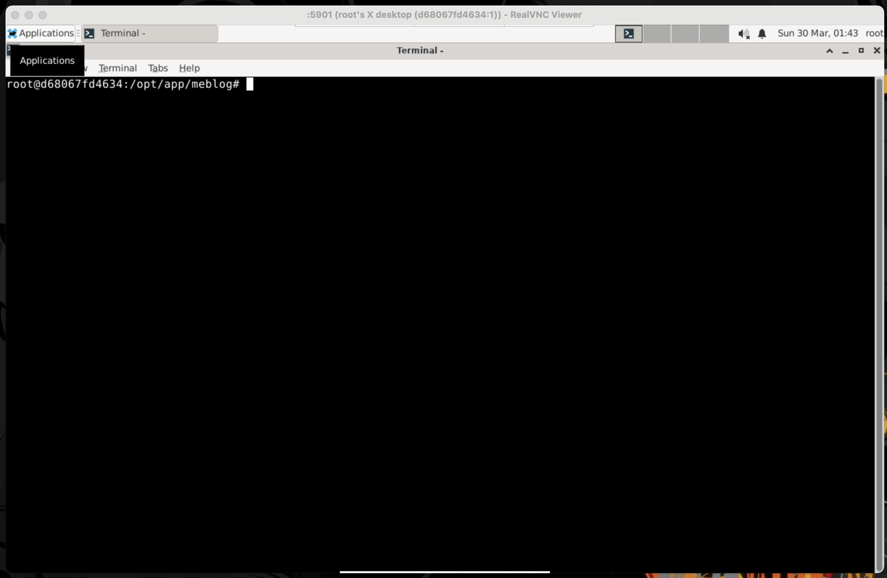

# mainframenzo.com
This is the source for your silly blog. The documentation below addresses _future_ you. 


FYI: You reset the commit history every time you push to this public repository; it's always the "First commit." (as my mentor once said, "It's a new day, baby")

----

This source provides three ways to get started writing posts:
* Container
* Virtual Machine
* Host OS (locally)

Docker is not a hard dependency for writing posts, but it can simplify dependency installation, and _definitely_ made developing the parts libraries easier with MacOS (Apple M3) as your host OS. You also provided a Virtual Machine as an "escape hatch". Mostly you write posts on your host OS (locally), and then run a container (via Docker, currently) if you need to do parts libraries development in tandem.

## Local Development - Docker
If you already have your designs finalized and rendered, you can move along and just install some standard dependencies locally to write your posts.

### Local Development - Docker / Pre-reqs
1. [Docker](https://www.docker.com/) `27.3.1, build ce12230` (used to launch a container for local development)
1. [(GNU) make](https://www.gnu.org/software/make/) `3.81` (used for command orchestration)
1. [Real VNC](https://www.realvnc.com/en/connect/download/viewer/) (or any VNC viewer - used for viewing container guest OS display from host OS)

----

To use Docker to start viewing content and making changes to the website locally, from a terminal, run:
```bash
make -f makefile.docker docker/setup
make -f makefile.docker docker/develop/website
```

The `<meblog-src>/src` directory is mouted as a read/write volume, and changes you make on your host OS will propagate to the guest OS. You'll need to open up a browser tab at [http://localhost:8080](http://localhost:8080) to view the website. You can also open a browser tab up at [http://localhost:8081](http://localhost:8081) to use Visual Studio Code + OCP CAD Viewer in the container to preview changes you make to the parts libraries. 

If you want to connect to the guest OS's desktop GUI, you used RealVNC and entered in `:5901` as the "hostname or address", and `meblog` as the password:


Once inside the container, you can run these software programs to develop parts libraries:
* CQ-editor - From a terminal, run: `cd / && ./CQ-editor/CQ-editor`

## Local Development - Virtual Machine
Some of the software you are using hasn't quite caught up to the new Apple hardware, and you're even having issues with Docker containers when it comes to some headless rendering dependencies. If you experience issues with installing dependencies, either on your host OS or via Docker, you can take it one step further and do local development on a virtual machine to "ease your pain". Move along if you've got all the dependencies installed one way or another.

### Local Development - Virtual Machine / Pre-reqs
1. [Virtual Box](https://www.virtualbox.org/) `7.1.4 r165100 (Qt6.5.3)` (used to launch a Linux-based VM for local development)
1. [Vagrant](https://www.vagrantup.com/) `2.4.3` ^  (used for VM configuration and deployment)
1. [(GNU) make](https://www.gnu.org/software/make/) `3.81` (used for command orchestration)

----

```bash
make -f makefile.vagrant vagrant/setup
make -f makefile.vagrant vagrant/develop/website
```

Inside the VM you'll need to open up a browser tab at [http://localhost:8080](http://localhost:8080).

## Local Development
You can develop the website locally if you're already pre-rendered the parts libraries.

### Local Development / Pre-reqs
1. 'Nix machine (you are on Apple M3 / MacOS or Framework 13 / Ubuntu, YMMV elsewhere)
1. [Node.js](https://nodejs.org/en/download) `20.16.0` (used for build and website dependency ecosystem)
1. [Python](https://www.python.org/) `3.13.1` (used for defining and rendering parts libraries)
1. [conda](https://anaconda.org/anaconda/conda) (use for installing Python dependencies for rendering parts libraries) `24.9.2`
1. [(GNU) make](https://www.gnu.org/software/make/) `3.81` (used for command orchestration)
1. [jq](https://jqlang.github.io/jq/) `1.6` (used for working with JSON in the CLI) 
1. [rsync](https://linux.die.net/man/1/rsync) `version 2.6.9 protocol version 29` (used for copying files)
1. [gzip](https://gzip.org/) `Apple gzip 430.140.2` (used for starting cicd) 
1. [lychee](https://github.com/lycheeverse/lychee) used to check broken links

### Local Development / Pre-reqs for Parts Libraries
If you want to work on the parts libraries, the dependencies grow.

1. [Blender](https://www.blender.org/download/) `4.2` (used for rendering parts libraries)
1. [FreeCAD](https://wiki.freecad.org/Main_Page) `1.0.0` (used for analyzing parts libraries)
1. [CalculiX](http://www.dhondt.de/) `costerwi/homebrew-calculix/calculix-ccx` (used for analyzing parts libraries)
1. [PySide](https://wiki.qt.io/PySide2) and [qt](https://doc.qt.io/) - (dependencies of FreeCAD - while you installed both via [Homebrew](https://brew.sh/) (see the [FreeCAD wiki on PySide/QT](https://wiki.freecad.org/PySide)), and ran `pip3 install pyside6`, nothing worked)
1. [imagemagick](https://imagemagick.org/index.php) `7.1.1-43` (used for generating .gif files of an assembly's movements)

You had issues getting any [build123d](https://build123d.readthedocs.io/en/latest/) development rendering tools working on MacOS (it required adding [mamba](https://mamba.readthedocs.io/en/latest/installation/mamba-installation.html) as a dependency on top of `conda`, and something about the mamba install got wonked no matter what you tried). You tried these 3D viewers:
1. [OCP CAD Viewer](https://github.com/bernhard-42/vscode-ocp-cad-viewer)
1. [CQ Editor](https://github.com/jdegenstein/jmwright-CQ-Editor) 
1. [blendquery](https://github.com/uki-dev/blendquery)

Docker should not be a hard dependency, but if you want to develop parts libraries and visualize the changes to them quickly, it will help you bypass any issues encountered on MacOS. Why? None of these 3D viewers seemed to work particularly well (or at all!). It could be that Apple and `conda` are very well the problem, not the software itself. You settled on OCP CAD Viewer, but using it is not "automatic" - see the [Utilities / Parts Library Rendering](#utilities--parts-library-rendering) section at the bottom of this readme for details on how to get that going inside a container.

> Any other pre-reqs or third-party libraries needed will be downloaded at setup time automatically.

### Local Development / Pre-reqs for Utilities
The `makefile` includes utilities you can run to help write posts.

1. [ffmpeg](https://www.ffmpeg.org/) `7.1` (used for compressing videos)
1. [f3d](https://github.com/f3d-app/f3d) (used for previewing .stl files generated from parts libraries)
1. [Audacity](https://www.audacityteam.org/) (used for recording/editing audio)

### Local Development / Setup
Once you have the pre-reqs installed, install the Node.js/NPM and Python/conda dependencies needed to build the website. From a terminal, run:
```bash
make setup # Only need to do this once.
```

> `make setup` has global side effects!

If you update/add any dependencies in/to the `./npm/*.npm.ts` files or the `./meblog.conda.yaml` file, from a terminal, run:
```bash
source ~/.bash_profile && conda deactivate # Because you always forget about adding conda to PATH.
make install
```

### Local Development / Writing Posts
To start viewing content and making changes to the website locally, from a terminal, run:
```bash
source ~/.bash_profile && conda deactivate # Because you always forget about adding conda to PATH.
make develop/website
```

This opens up a browser tab at [http://localhost:8080](http://localhost:8080). Making a change to most files rebuilds and reloads the website.

Posts are a mixture of Markdown and HTML. The Markdown syntax for the converter - Showdown - can be found [here](https://github.com/showdownjs/showdown/wiki/Showdown%27s-Markdown-syntax). Create posts in the `<meblog-src>/src/frontend/posts/` directory as a `.md` file. The name of the file is the name of the post, sans the file extension (spaces in filenames...oh the humanity!). 

Each post needs to specify some information as "JSON-in-an-HTML-comment" at the top of the file (a nod to [Jekyll](https://jekyllrb.com/)) in order to be picked up as content for the website:
```html
<!-- 
{ 
  "draft": true,
  "type": "#thingsivemade",
  "publishedOn": "January 1, 1970", 
  "tagline": "\"When in the course of computer events...\""
}
-->
```

Have a look at some existing posts for examples of what else you can do with that JSON.

Tidbits you may forget:
* Some downloads need to be manually generated: run `make build/downloads` before publishing (do this with the local development server running)
* Only posts marked as **"draft": false** will be _published_ to the _prod_ stage

#### Local Development / Writing Posts / Style Guide
1. Numbers are written, e.g. fifteen not 15, except: 1) years, e.g. 2025 not two thousand and five 2) monetary values, e.g. $5.15 USD, not five dollars and fifteen cents in USD 3) In my 20's/30's/40's not twenties/thirties/forties 4) resume job durations, e.g. 2, not two 5) Coordinates, e.g. (0, 0) not (zero, zero) 6) 15 miles-per-hour or miles-per-gallon not fifteen 7) 10% not ten percent
1. Videos need be formatted as .mp4 files. 
1. Images can be any format supported by the web.
1. Slideshow HTML templates are built using images prefixed with img_ in the respective post's image directory. To add images to slideshows, make sure that they follow the format: img_1.png, img_2.png, etc.
1. For BOMs (csv files), rememember that inches as `"` are escaped like `""`.

You _could_ implement some sort of spellcheck linter thingy, but uh, where's the fucking fun in that?

#### Local Development / Writing Posts / Parts Libraries
Each post has a "parts library", which is a collection of 3D file formats and CAD-as-code Python scripts that help define the #thingsivemade. It's an ongoing modernization process, and I'm doing some work outside this source to make it all more cohesive. FYI.

To _build_ all the parts libraries before developing the website, optionally pass `build_parts_libraries=true` as a flag, e.g. `make build_parts_libraries=true develop/website`. Building parts libraries consists of things like rendering images of parts, converting parts to other 3D file formats the website makes use of, etc.

FIXME You can't get a parts library build to work 100% on your Mac because of the issue with running Blender from inside a conda environment, and importing the Python modules from the conda environment does not seem to work (see `./src/parts-library-tools/stl-to-photorealistic-pngs.py` for the failure). So, you use Docker to manually build a post's parts library. To manually build a post's parts library, first start a terminal session in a container:
```bash
make -f makefile.docker docker/shell
```

Then build the part library for the post inside the container:
```bash
cd /opt/app/meblog

make assembly_file=./src/frontend/public/parts-libraries/posts/volkswagen_bus_dashboard/v2/assembly.py build/part-library
```

## Infra
GoDaddy is your DNS registrar. AWS is your hosting provider. You're viewing this source on Github, which is where the public version of this source is shared. YMMV elsewhere. Hell, your mileage varies with these companies!

You've got a _dev_ publish stage and a _prod_ publish stage: `dev.mainframenzo.com` includes all content, including `draft` posts, but [mainframenzo.com](https://mainframenzo.com) only has finished ones. You use _dev_ to validate the content looks as expected before pushing to _prod_. You restrict access to _dev_ via your public IP (and the security settings can be  updated manually when required).

The infra setup is not fancy: there's just one AWS account for the _publish_ stages _dev_ and _prod_ because this is a silly blog. We'll call your AWS account "main", which is a _deploy_ stage, and when you deploy, you'll run commands that change resources for the respective _publish_ stage in the "main" _deploy_ stage (AWS account); _publish_ stages - _dev_ or _prod_ - are only delineated by AWS CloudFormation stacks (groups of AWS resources) in the same AWS account. 

As for CICD, you set it up so that after an initial deployment of _CICD_ itself, all that is required to push content is to sync this source to an Amazon S3 bucket, then CICD starts (you prefer this to using the Github connector because you don't have to manage AWS Secrets, which are expensive). Once CICD publishes content to _dev_, your manual approval is required to go from _dev_ to _prod_.


Your average AWS bill with limited visitors to the _dev_ publish stage was: $10.17 USD. AWS CodeBuild is was by far the biggest cost when you were doing serious initial development of this website and increased the price 6x, but that shouldn't happen again.

### Infra / Pre-reqs
1. [AWS CLI V2](https://docs.aws.amazon.com/cli/latest/userguide/getting-started-install.html) `aws-cli/2.4.0 Python/3.8.8 Darwin/22.6.0 exe/x86_64 prompt/off` and an `~/.aws/credentials` file with active credentials

### Infra / Configure
To configure the "main" AWS account, configure the `<meblog-src>/config/.env` file with your AWS information for the "main" AWS account. Edit this information:

    aws_main_cli_profile=meblog-main
    aws_main_account_id=123456789012
    aws_main_region=us-west-2
    aws_main_deploy_id=v1-sys
    aws_main_cdk_qualifier=meblogcdk1
    aws_main_dev_domain_name=dev.website.com
    aws_main_prod_domain_name=website.com

> The `~/.aws/credentials` file is also required to exist on disk, and the credentials for the AWS CLI profile defined above to be configured in it.

### Infra / CICD
To deploy CICD resources to your "main" AWS account, from a terminal, run:
```bash
make -f makefile.infra deploy/main
```

The `deploy/main` command does a lot! There's additional documentation if you want to dive into the weeds further down, but we're going to skip the details for now. 

Once that's done, CICD will start. Eventually the changes will matriculate to `dev.mainframenzo.com`, but not before some manual intervention on your end:
* You still need to configure some DNS settings in GoDaddy's web portal after the "routing" and "cert" AWS CloudFormation stacks have been created (the latter will _still_ be deploying when you make the configuration change)
* The _prod_ stage won't be deployed until you manually approve changes to _dev_

> Note: If you see that CICD fails because the "cert" AWS CloudFormation stack has "an ongoing operation in progress and is not stable (CREATE_IN_PROGRESS)", it's because you failed to complete the DNS configuration step below after the "routing" and "cert" AWS CloudFormation stacks were created. 

### Infra / DNS
GoDaddy's NS record for your [mainframenzo.com](https://mainframenzo.com) needs to be configured to point to AWS after CICD has created the necessary AWS resources ("routing" and "cert" AWS CloudFormation stacks). 

> Note: [GoDaddy fucked everyone by removing API functionality to do this automatically](https://www.reddit.com/r/godaddy/comments/1bl0f5r/am_i_the_only_one_who_cant_use_the_api/), so that is why this is a manual endeavor.

To grab the info you'll need to enter into the GoDaddy web portal, from a terminal, run:
```bash
make -f makefile.infra get-routing-info/main

...
"DelegationSet": {
  "NameServers": [
    "ns-xxx.com",
    "ns-xxxnet",
    "ns-xxxc.o.uk",
    "ns-xxx.org"
  ]
}
```

Manually enter the info into the `Domain > Domain Settings > DNS > Nameservers + Change Nameservers` portion of the GoDaddy web portal (for your domain) until you get some time to migrate away from GoDaddy.


If CICD failed because the certificate for `dev.mainframenzo.com` could not be validated, restart CICD by running `make -f makefile.infra start/cicd/main` again after the "cert" AWS CloudFormation stack finally completes deploying.

Also, `dev.mainframenzo.com` is restricted to your public IP, which may change. If you find that you can't access `dev.mainframenzo.com` once it's published, from a terminal, run:
```bash
make -f makefile.infra restrict-dev-to-public-ip/main
```

> Note: This currently starts CICD. Ideally you do not want to deploy AWS resources, but you are having trouble updating the AWS WAF configuration without deploying.

### Infra / Publish
When you want to publish content, that means:
* Sync this source to an Amazon S3 bucket (CICD publishes changes to `dev.mainframenzo.com` and eventually [mainframenzo.com](https://mainframenzo.com) after manual approval)
* Upload some of this source to the public Github repository you're viewing

You do not need to do these both at the same time!

To publish content to AWS + Github at the same time, from a terminal, run:
```bash
make -f makefile.infra publish
```

#### Infra / Publish / Github
You are working with a private version of this source which contains unpublished posts (drafts) and sensitive information. That information needs to get scrubbed and reset when this source is made public. To do that (and push to the public repository), first make sure your CWD is the directory with the private version of this source. 

To upload some of this source to the public Github repository you're viewing, from a terminal, run:
```bash
make -f makefile.infra push-to-public-repo
```

#### Infra / Publish / AWS
To sync this source to an Amazon S3 bucket that was created earlier and start the CICD process, from a terminal, run:
```bash
make -f makefile.infra start/cicd/main
```

If you're interested, let's get into the weeds now.

## Infra / Deep Dive
If you followed the above documentation, there's no need to run thee commands below manually - they're documented here for your understanding.

### Infra / Deep Dive / AWS CDK Bootstrap
AWS resources needed for CICD and the website are defined using the AWS CDK. That means cloud infrastructure is defined in code. This requires a bit of setup, though you mostly just reuse the boilerplate code you wrote once, sans a few changes here and there, for common things like CICD/website deploys. You can find plenty of sample code for the AWS CDK if you forgot it all.

To deploy the AWS resources necessary for the website to work with the AWS CDK, from a terminal, run:
```bash
make -f makefile.infra deploy/cdk/main # AWS CDK bootstrap with custom AWS CloudFormation template in your configured region.
```

> This creates a specific AWS CloudFormation stack for the AWS CDK so you don't run into collisions with other AWS CDK-based deployments in our "main" AWS account, which might use different versions. These resources are required to define infra-as-code using the AWS CDK.

### Infra / Deep Dive / AWS CloudFormation Synth
You can "synth" any CDK-generated AWS CloudFormation stack to test infra-as-code compilation by passing in `cdk_action=synth` to the make commands, which (sort of) helps test if the infra code will work _before_ you deploy:

To synth the CICD AWS CloudFormation stack before deploying, from a terminal, run:
```bash
make -f makefile.infra cdk_action=synth deploy/cicd/main
```

To synth the AWS CloudFormation stacks that CICD deploys (everything needed to host website), from a terminal, run:
```bash
make -f makefile.infra cdk_action=synth app_location=local stage=main publish_stage=dev aws_cli_profile_arg="--profile meblog-main" deploy/from-cicd
```

> Make sure to change `meblog-main` to your configured AWS CLI profile. 

Let's finally deploy rather than synth. 

### Infra / Deep Dive / CICD
To deploy the AWS resources necessary to get CICD up and running, from a terminal, run:
```bash
make -f makefile.infra deploy/cicd/main
```

### Infra / Destroy
It is useful to blow all the AWS infra up from time-to-time, especially if you broke something "upgrading" packages, and extra specially useful when starting out with AWS initially. To remove all the AWS infrastructure for the _main_ stage (start over!), from a terminal, run:
```bash
make -f makefile.infra destroy/main
``` 

## Utilities
### Utilities / Images
Images may need to be "fixed up" before being website ready: they may contain lots of personal metadata we don't want exposed, and their names may be formatted incorrectly. Also, any images prefixed with `IMG_` will be renamed to `img_` starting at an index of 1. To "fixup" images, from a terminal, run:
```bash
make image_dir_path=src/frontend/public/images/posts/footstool fixup-images
```

> TODO CICD checks images for metadata we don't want exposed and blocks publishing if it finds unwanted information, but it's up to you to use the utilities to format/scrub images manually as deemed necessary.

### Utilities / Videos
Videos may need to be "fixed up" before being website ready: Github has an upper limit for file size when not using Git LFS. We eventually caved to using Git LFS, but it still costs money with Github, so this utility provides a way to reduce the file size of videos (thus saving money). 

To "fixup" all videos over 100 MiB, from a terminal, run:
```bash
make fixup-videos
```

To "fixup" a video, from a terminal, run:
```bash
make input_file=$(pwd)/src/frontend/public/video/posts/adam/v1.mp4 input_file=$(pwd)/src/frontend/public/video/posts/adam/v1_reduced.mp4 fixup-video
```

### Utilities / Parts Library Rendering
You had issues getting [OCP CAD Viewer](https://github.com/bernhard-42/vscode-ocp-cad-viewer) to work for previewing a parts library on your Apple M3. You had less issues using containers, but the development setup still needs some work.

Here's what you were looking for:
1) Visual Studio Code to startup and open a terminal with the conda env containing dependencies activated
1) OCP CAD Viewer's backend hot-reloading code when you use the "Save" hot keys on your keyboard

Here's what you got:
1) Visual Studio Code starts up
1) You open a Python assembly file in the editor and OCP CAD Viewer starts up automatically and renders a dummy file
1) Manually open up a new terminal (right click in an existing terminal window to see the shortcut you always forget)
1) Make an _important_ change to the assembly file: `from ocp_vscode import *` provides a `show` function, but you can't just leave that in the source when it's not running (breaks the "headless" path), so uncomment it and save the assembly file
1) Open up the readme in the editor to copy what you'll run (FIXME can't paste into the editor environment in my browser of choice)
1) Run Python assembly file, either manually after change via `PYTHONPATH=/opt/app/meblog/src/parts-library-tools /opt/conda/envs/meblog/bin/python /opt/app/meblog/src/frontend/public/parts-libraries/posts/test/assembly.py`, or automatically via `while inotifywait -e close_write /opt/app/meblog/src/frontend/public/parts-libraries/posts/test/assembly.py; do PYTHONPATH=/opt/app/meblog/src/parts-library-tools /opt/conda/envs/meblog/bin/python /opt/app/meblog/src/frontend/public/parts-libraries/posts/test/assembly.py; done`

OCP CAD Viewer should display the assembly now:


If at any point OCP CAD Viewer gets wonky, just close the window, kill the terminal process, and select inside a Python assembly file to have it restart.

In the event OCP CAD Viewer works, here is a much worse stop-gap solution which piggy-backs off the rendering logic for website builds. To see refreshed previews of an assembly, from a terminal, run:
```bash
make \
  input_files="$(pwd)/src/frontend/public/parts-libraries/posts/globe_trotter_suitcase/*.py" \
  assembly_py="$(pwd)/src/frontend/public/parts-libraries/posts/globe_trotter_suitcase/assembly.py" \
  assembly_stl="$(pwd)/src/frontend/public/parts-libraries/posts/globe_trotter_suitcase/assembly.stl" \
  develop/watch/parts-libary
```

In a web browser, open up the file:// path of the SVG. It should look something like this:


## License
Unless explicitly called out, all files in this source are licensed under the [MIT-0 license](https://opensource.org/license/mit-0).

Files that are licensed differently from above:
* The files in [this directory](./src/frontend/public/downloads/posts/globe_trotter_suitcase/darjeeling-limited-luggage/) are licensed under the [CC BY-NC 3.0 license](https://creativecommons.org/licenses/by-nc/3.0/). The images are _interpretations_ of someone else's original material, and the CAD files are extruded from the interpreted images - obviously commercial use is out of the question. Unfortunately, Alberto Favaretto did not comply with the license terms, but you should.
* Any Blender scripts - you'll find a lot of them in [this directory](./src/parts-library-tools/) - are licensed under the [GPL-3.0-only license](https://www.gnu.org/licenses/gpl-3.0.en.html) (you think).
* Any Blender add-ons you downloaded to [this directory](./src/parts-library-tools/blender-add-ons) are licensed under [GPL-2.0-or-later license](http://download.blender.org/release/GPL-license.txt) (you think).
* Any [bd_warehouse](https://github.com/gumyr/bd_warehouse) files you downloaded, included, and modified are licensed under the [Apache-2.0 license](https://www.apache.org/licenses/LICENSE-2.0.html) license (you think).
* Any [dl4to4ocp](https://github.com/yeicor-3d/dl4to4ocp) files you downloaded, included, and modified are licensed under the [MIT license](https://mit-license.org/) (you think).
* Any [sdftoolbox](https://github.com/cheind/sdftoolbox) files you downloaded, included, and modified are licensed under the [MIT license](https://mit-license.org/) (you think).
* Licenses for materials in [this directory](./src/parts-library-tools/meblog/materials/) are licensed under [RF licenses](https://www.blenderkit.com/docs/licenses/) (you think).
* You are not sure what license the beso-fea files you downloaded, included, and (maybe?) modified are. FIXME

Licensing can be particularly complicated, and you may or may not not be in compliance ¯\_(ツ)_/¯. If you (_you_ here referring to _any_ reader, not just _future_ you) see a discrepancy, please create an issue on Github. Thanks!
